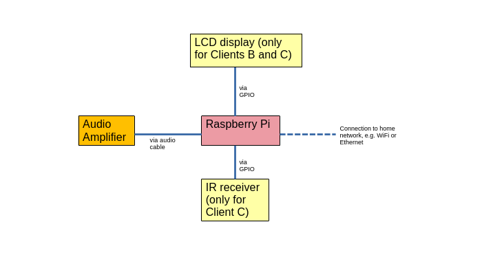

# Introduction

This in-progress project aims to create a [Music Player Daemon (MPD)](https://www.musicpd.org/) based internet radio player on Raspberry Pi 3, with functionalities similar to that of an actual radio. In its most advanced state (Client C), the player will have an LCD display (HD44780U-compatible) showing station information and remote control via infrared-red (IR) receiver, without having to use a separate client (e.g. laptop) for control via SSH. 

Please note that this player works only if the station's streaming URL is *static*, i.e. they do not change frequently and do not have protection mechanisms (such as URL signing) built in.

We will implement three different clients, with each increasing in level of complexity:

1. Client A - This is the most basic client which is controlled by logging in through SSH. No additional hardware beyond the Raspberry Pi is required. Control of the player is over a typical private home network, so this would need another device on the network capable of running an SSH client.
2. Client B - This client adds an LCD display which shows station information, but is otherwise mostly similar to Client A in terms of control.
3. Client C - This client will have both an LCD display and an IR receiver. Under normal circumstances, it should function without having to log in through SSH. Station change and the running of most functions will be done through an IR remote control.

Although Raspberry Pi 3 is used in the implemention of this project, the directions provided here should generally work for Pi 2 and 4, with slight modifications here and there. It is assumed that the reader has some working familiarity with Linux commands.

# Implementation and Usage

This project is implemented in Python 3, available on Raspberry Pi's official images. We have used [Raspberry Pi OS Legacy (Bullseye)](https://www.raspberrypi.com/software/operating-systems/) since we are working headless over WiFi and it is slightly easier to get it configured to connected to the Pi during setup.

For the Python client, we are using [musicpd](https://pypi.org/project/python-musicpd/). Our internet radio client should also interface with both 16x2 and 20x4 LCD displays - the two most commonly available types of HD44780U-compatible on the market. The code assumes that the LCD display works in I2C mode, so an I2C backpack should already be installed on the display.

As for the IR remote control, this is still under development. The plan is to use an existing remote control used by another unused device at home and repurpose it to control this internet radio player. This would require the testing of various remote controls and IR receivers, the capturing and identification of IR codes, as well as the implementation of event-driven code, and is no doubt the most tedious and complex aspect of this project.

*Update 15 Jan 2024*: Clients A and B are both implemented in a single script `miniplayerR2.py`. These scripts can be run from any directory accessible by the user (using the command `python /path/to/miniplayerR2.py [A | B]`) and should not require elevated permissions. However, the path to the stations configuration file `stations.yaml` is hardcoded into the scripts as `$HOME/.radiorpi3/stations.yaml` and the appropriate directory should be created for this file. The older implementations of Clients A and B in `miniplayer.py` and `miniplayer_lcd.py` are deprecated and moved to the `archive` directory of this repository. The implementation has been streamlined so that common code is kept in `RadioRPi3.py`.

Further details on the various clients and components of this project can be found at these pages:
- [Station configuration file](docs/stations.md)
- checkstreaminfo.py script
- [Client A](docs/usageclientA.md) (`miniplayerR2.py A`)
- [Client B](docs/usageclientB.md) (`miniplayerR2.py B`)
- Client C

*To be updated.*

# Build Instructions

1. Setting up the Raspberry Pi 3
2. Installing the software packages
3. MPD Configuration
4. Updating the station configuration file

*To be updated.*

# References

*To be updated.*
