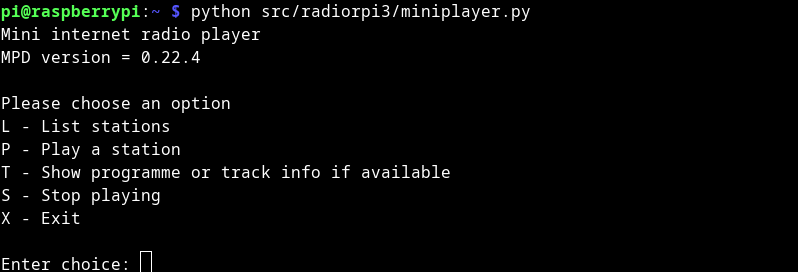

# Client A usage

## Running the client

Once the Raspberry Pi OS has been properly configured (see build instructions), simply log into the Pi and invoke the client (`miniplayer.py`) using Python:

```
python /path/to/miniplayer.py
```



In the screenshot above, the client script is stored at the path `$HOME/src/radiorpi3/`. 

## Listing the stations

A menu of options is presented when the script is run. At the same time, the script reads from `$HOME/.radiorpi3/stations.yaml` and adds the stations defined there to a playlist. The list of stations can be display by selecting the option `L` (non-case sensitive). Simply enter `L` and press \<return\>.


## Playing a station

To play a station, select option `P` and enter the index of the station. In the screenshot below, we have selected "MPR Choral", located at index 6 on the station list. The station will start playing.


## Showing track information

Some stations provide additional information for the song or programme currently playing. Select option `T` to view this information.


To check if a station provides programme information, we can use the script `checkstreaminfo.py` - refer to *this page* (link to page to be updated) for more details.
