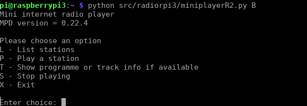
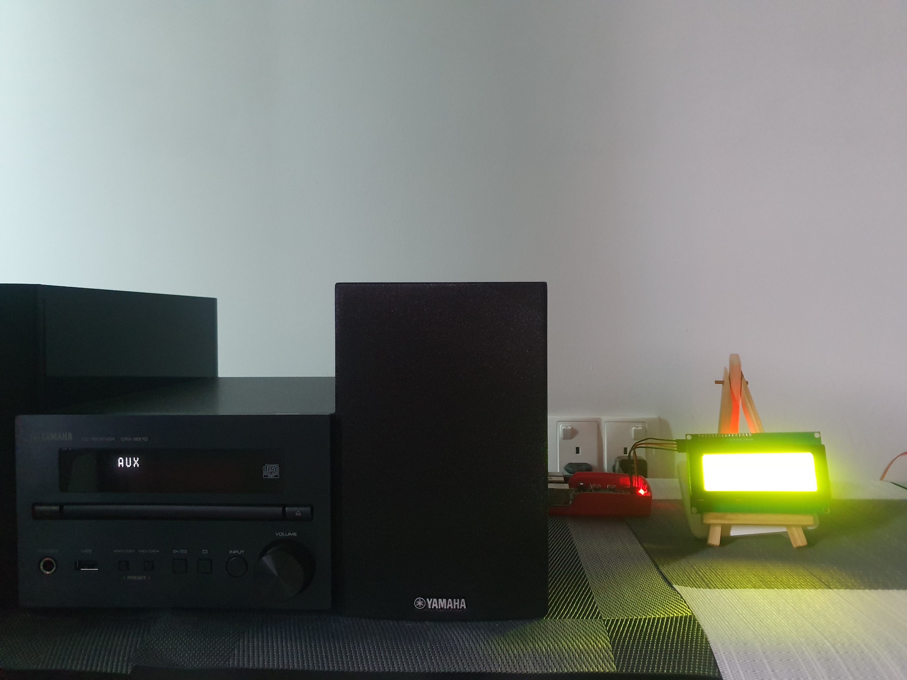
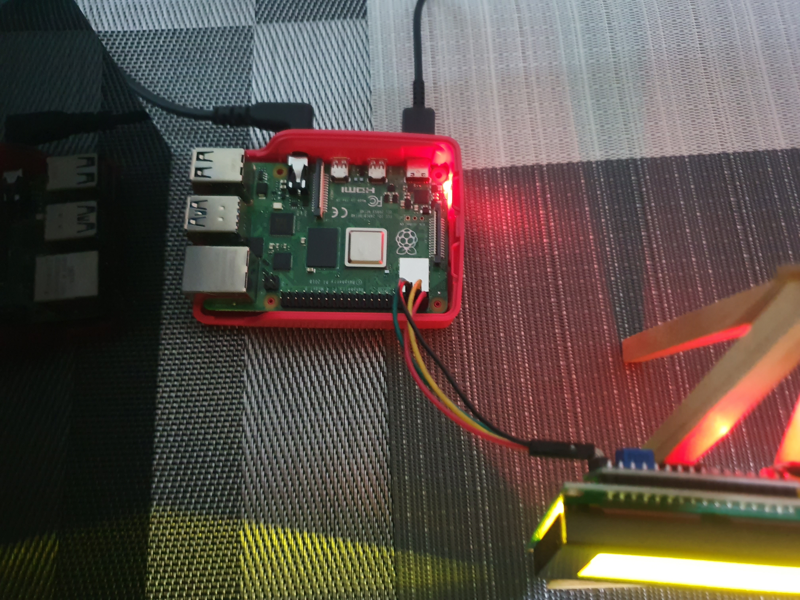
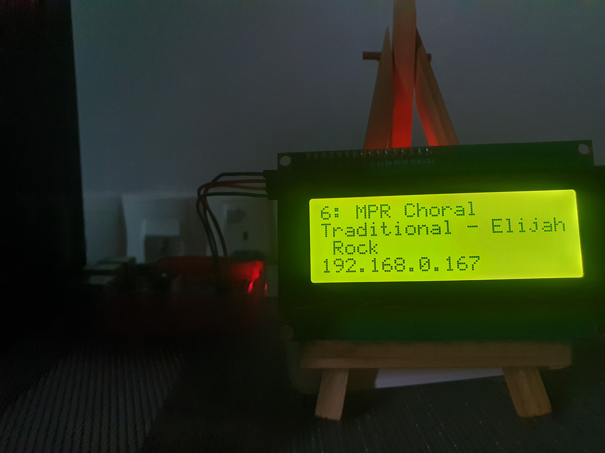

# Client B usage

## Running and using the client

The usage and invocation of this client is largely the same as for Client A and should be used when a compatible LCD is available. Once the Raspberry Pi OS has been properly configured (see build instructions) and the LCD properly connected, simply log into the Pi and invoke the client using Python:


```
python /path/to/miniplayerR2.py B
```



Usage of Client B is largely similar to that for Client A - refer to [Client A's usage page](usageclientA.md) for details.

## LCD display and connections



Client B extends the functionalities of Client A by adding an LCD display. Currently, Client B only supports **HD44780U-compatible 20x4** (20 columns, 4 rows) displays, which can usually be bought for a dollar or two each. With an I2C backpack, which is usually presoldered onto the LCD board, the number of connections to the Raspberry Pi can be cut down to four, i.e. 5V (VCC), GND, SDA and SCL. Using jumper wires, we have connected the LCD display to the corresponding pins on the Pi, as shown in the photo below. Note that the pin layout on different versions of the Raspberry Pi may differ slightly. Extra care should be taken here!



Versions of the Raspberry Pi from 2 to 4 already come with audio output sockets for the standard 3.5mm connector. An appropriate cable should be used to connect the Pi's audio out to the amplifier's audio in. In my case, my amplifier gets audio input through a 3.5mm socket and I use a 3.5mm male-male audio cable to connect the Pi to my amplifier.

## Information on LCD display



Client B displays the station name, programme information (usually the currently playing song's title, if available) and IP address of the Pi on the LCD display when a station is playing. The station name is specified in the configuration file `stations.yaml` (first line in the display above). If programme information is available, it is shown on the second and third lines of the display. The IP address would be shown on the last line. In the photograph above, the station name is `MPR Choral`, song title is `Traditional - Elijah Rock` and the IP address is `192.168.0.167`. The client will poll MPD once every few seconds to check for updates to the programme name.

If programme information is not available for a station, the LCD display will only show the station name and IP address on the first two lines.
